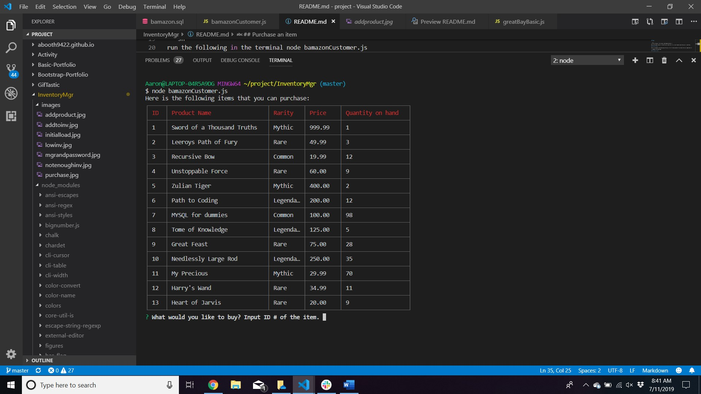
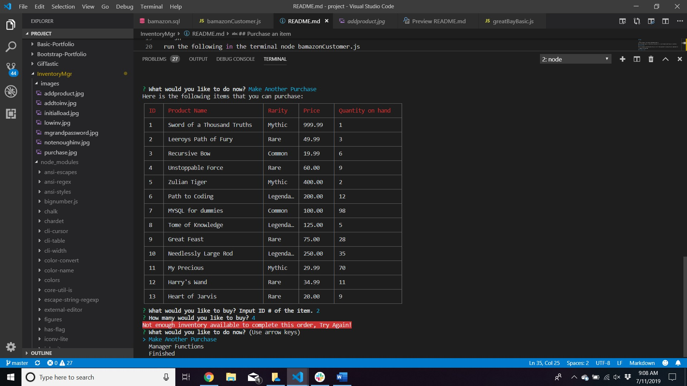
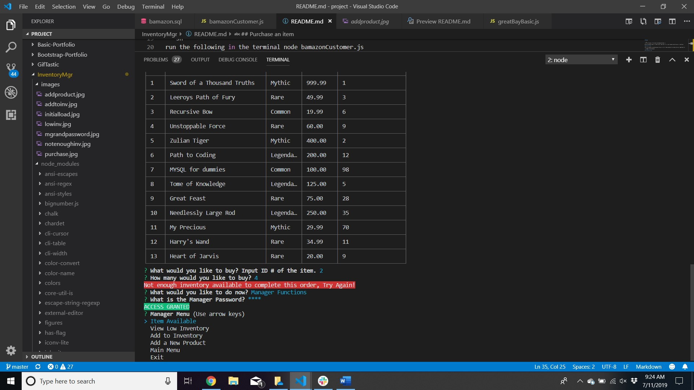

<h1 align="center">Welcome to InventoryMgr 👋</h1>
<p>
  
  <a href="https://github.com/ABooth9422/InventoryMgr/blob/master/README.md">
    
  </a>
  <a href="https://github.com/ABooth9422/InventoryMgr/graphs/commit-activity">
    
  </a>
</p>

> Node & MYSQL project to show how node can join mysql with responses

### 🏠 [Homepage](https://abooth9422.github.io/InventoryMgr/)

## Usage


```sh
run the following in the terminal node bamazonCustomer.js

We use the plugin inquirer to take the user input and return a result based on what they user is inputting
```
## Initial Screen
---
After our program is executed we give the user a list of items available for purchase the price, department,etc.



## Purchase an item
---
On the initial load we prompt the user to purchase an item based on the ID of the item in the table. If the user selects an item
by ID and specify the quantity it will purchase that item and show the user the total for the purchase.


## Not enough inventory available
---
If the user specifies they want to purchase more of an item than that is contained in the database it will not allow you to execute that function



## Manager Menu
---
After the initial purchase has been made we prompt the users to see if they want to either be finished or go into the manager menu. The 
manager menu does require a password to be in the manager :1234. If the user does not input the correct passwor they will not be able to go into the manager menu.


After that function it will inquire the following menu for the manager menu:<br />
 <ul> <li>View Products For Sale</li>
  <li>View Low Inventory</li>
  <li>Add to Inventory </li>
  <li>Add New Product</li></ul>

  

## View Products For Sale
---
We update our table with all the information from the previous requests and functions and we display it for the user.
Picture referenced in previous example.

## Add to Inventory
---
We tell the user to select an ID of an item that they want to add to the inventory. After that we give them a confirmation
that there inventory has been added.


## Add Product
---
We use inquirer to ask questions to the user to essentially query the entire table to make a row and insert it directly into
our mysql database. Then we tell the user if there request has been successful or not in adding the product they specified.


## Author

👤 :skull: **Aaron Booth** :skull:

* Github: [@ABooth9422](https://github.com/ABooth9422)

## 🤝 Contributing

Contributions, issues and feature requests are welcome!<br />Feel free to check [issues page](https://github.com/ABooth9422/InventoryMgr/issues).

## Show your support

Give a ⭐️⭐️⭐️⭐️⭐️ if this project helped you!

***
_This README was generated with ❤️ by [readme-md-generator](https://github.com/kefranabg/readme-md-generator)_